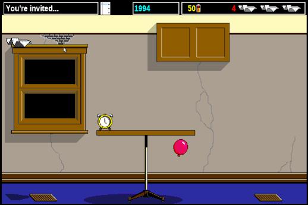
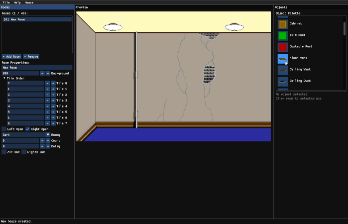

# Glider

Glider is a rewrite of the classic Macintosh game [Glider 4](https://github.com/softdorothy/Glider4), originally designed by John Calhoun. The code is written from scratch in C++ trying to replicate the gameplay of the original. It uses the original artwork and sounds. The reimplemented game can read and write house files in the original format, so existing houses work out of the box.



## Installing

The GitHub releases contain pre-built artifacts for Ubuntu Linux, MacOS and Windows.

The MacOS artifact isn't codesigned. So if you want to run it, run the following after extracting:

```sh
xattr -cr Glider.app
xattr -cr GliderEditor.app
```

## Building

All platforms use [vcpkg](https://vcpkg.io) to manage dependencies (SDL2, SDL2\_image, SDL2\_mixer). Install it and set `VCPKG_ROOT` to its location before building.

**Linux / macOS:**
```sh
git clone https://github.com/microsoft/vcpkg "$HOME/vcpkg"
"$HOME/vcpkg/bootstrap-vcpkg.sh"
export VCPKG_ROOT="$HOME/vcpkg"
```

**Windows (PowerShell):**
```powershell
git clone https://github.com/microsoft/vcpkg "$env:USERPROFILE\vcpkg"
& "$env:USERPROFILE\vcpkg\bootstrap-vcpkg.bat"
$env:VCPKG_ROOT = "$env:USERPROFILE\vcpkg"
```

CMake presets are provided for all platforms. Use the preset matching your OS:

### Linux

```sh
cmake --preset linux-release
cmake --build --preset linux-release
```

### macOS

```sh
cmake --preset macos-release
cmake --build --preset macos-release
```

#### macOS (Xcode)

```sh
cmake --preset macos-xcode
```

The Xcode scheme is pre-configured with the correct working directory so resources are found when running from Xcode.

### Windows

```powershell
cmake --preset windows-release
cmake --build --preset windows-release
```

## Editor

A house editor is included and can be launched with:

```sh
build/glidereditor
```



## Copyright notice

The original game design, artwork, sounds, and house files are copyright © 2016 softdorothy and are used under the MIT License:

> Permission is hereby granted, free of charge, to any person obtaining a copy of this software and associated documentation files (the "Software"), to deal in the Software without restriction, including without limitation the rights to use, copy, modify, merge, publish, distribute, sublicense, and/or sell copies of the Software, and to permit persons to whom the Software is furnished to do so, subject to the following conditions:
>
> The above copyright notice and this permission notice shall be included in all copies or substantial portions of the Software.
>
> THE SOFTWARE IS PROVIDED "AS IS", WITHOUT WARRANTY OF ANY KIND, EXPRESS OR IMPLIED, INCLUDING BUT NOT LIMITED TO THE WARRANTIES OF MERCHANTABILITY, FITNESS FOR A PARTICULAR PURPOSE AND NONINFRINGEMENT. IN NO EVENT SHALL THE AUTHORS OR COPYRIGHT HOLDERS BE LIABLE FOR ANY CLAIM, DAMAGES OR OTHER LIABILITY, WHETHER IN AN ACTION OF CONTRACT, TORT OR OTHERWISE, ARISING FROM, OUT OF OR IN CONNECTION WITH THE SOFTWARE OR THE USE OR OTHER DEALINGS IN THE SOFTWARE.
